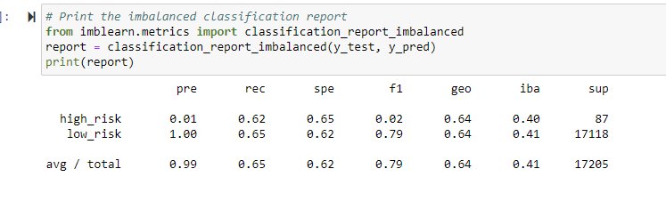
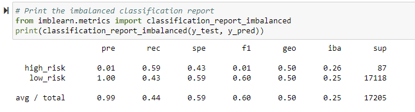
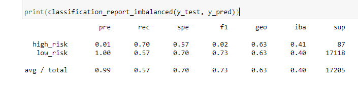
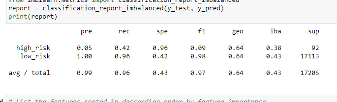
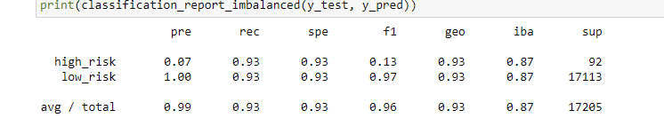

# Credit_Risk_Analysis

## Overview of the analysis
The purpose of this analysis was to utilize the imbalanced-learn and scikit-learn libraries to resample data and determine if the models would be appropriate to predict credit risk. Using a credit card dataset from a peer-to-peer lending company called LendingClub, data was oversampled using the RandomOverSampler and SMOTE algorithms, and undersampled using the ClusterCentroids algorithm. Next, a combinatorial approach of over- and undersampling was done using the SMOTEENN algorithm. Finally, the BalancedRandomForestClassifier and EasyEnsembleClassifier, two new machine learning models that reduce bias, were used to predict credit risk. Performance of these models was evaluated in order to recommend whether the models should be used to predict credit risk.

## Results

 - Naive Random Oversampling: This model yielded an accuracy score of 63.6%. Precision and recall scores were .01 and .62 respectively for high risk, and 1.0 and .65 respectively for low risk

 - SMOTE Oversampling: This model yielded an accuracy score of 63%. Precision and recall scores were .01 and .62 respectively for high risk, and 1.0 and .64 respectively for low risk

 - Undersampling: This model yielded an accuracy score of 63%. Precision and recall scores were .01 and .59 respectively for high risk, and 1.0 and .43 respectively for low risk

 - Combination (Over and Under Sampling): This model yielded an accuracy score of 51%. Precision and recall scores were .01 and .70 respectively for high risk, and 1.0 and .57 respectively for low risk

 - Balanced Random Forest: This model yielded an accuracy score of 69.1%. Precision and recall scores were .05 and .42 respectively for high risk, and 1.0 and .96 respectively for low risk

 - Easy Ensemble: This model yielded an accuracy score of 93.3%. Precision and recall scores were .07 and 93 respectively for high risk, and 1.0 and .93 respectively for low risk

## Summary

The logistic regression models should not be recommended for credit risk prediction based on the results of this analysis. The Ensemble classifiers were better models with higher accuracy rates and better precision, recall, and sensitivity scores. The Easy Ensemble model was the best predictor of credit card risk with the highest accuracy score at 93.3% and higher recall scores than the other models. Based on these results, I would suggest LendingClub use the Easy Ensemble model to evaluate credit risk. 
